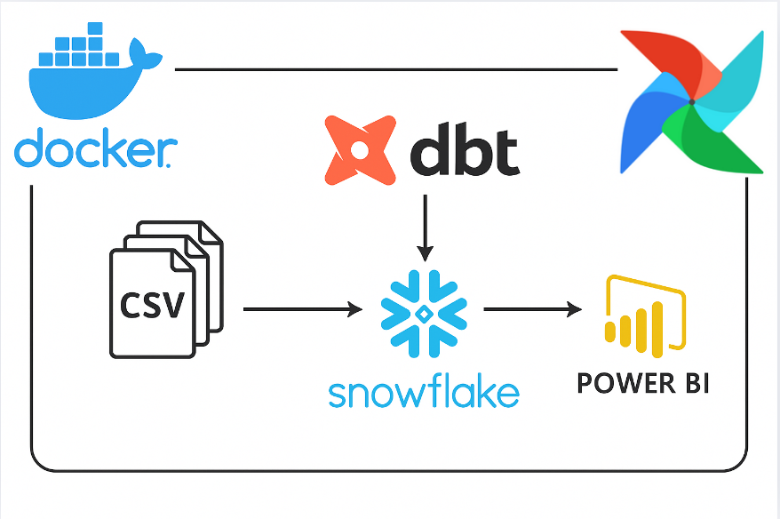

# 🚀 Modern Data Engineering Project with Snowflake, dbt, Airflow, Power BI & Docker



## 📌 Overview

This project demonstrates a modern **Data Engineering** pipeline using:

- **Snowflake** as the cloud data warehouse
- **dbt (Data Build Tool)** for data modeling and transformation
- **Apache Airflow** for workflow orchestration with **CeleryExecutor**
- **Power BI** for dashboard and reporting
- **Docker** for containerization and environment setup

The data consists of 4 CSV files:
- `orders.csv`
- `order_items.csv`
- `products.csv`
- `customers.csv`

These files are uploaded to a Snowflake stage named `sales_stage`, and then loaded into raw tables via `COPY INTO`. dbt is used to transform the raw data into structured models under `staging` and `marts` layers.

---

## 🗂️ Project Structure

```
.
├── Dockerfile
├── docker-compose.yml
├── .env
├── dags/
│   └── dbt_dag.py
├── dbt/
│   ├── dbt_project.yml
│   ├── profiles.yml
│   └── models/
│       ├── staging/
│       │   ├── stg_customers.sql
│       │   ├── stg_orders.sql
│       │   ├── stg_order_items.sql
│       │   └── stg_products.sql
│       └── marts/
│           ├── Countries_Quantities.sql
│           ├── Customer_Segmentation.sql
│           ├── Daily_Order_Revenue.sql
│           └── Status_Order_Count.sql
├── tests/
│   └── snowflake_test.yml
├── airflow_cfg/
├── airflow_db/
│   └── airflow.db
```

---

## ⚙️ Technologies Used

| Tool         | Role                             |
|--------------|----------------------------------|
| **Snowflake** | Cloud data warehouse              |
| **dbt**       | Data transformation and modeling  |
| **Airflow**   | Workflow orchestration            |
| **Power BI**  | Dashboard and visualization       |
| **Docker**    | Containerization and environment setup |

---

## 🧊 Snowflake Workflow

1. Upload CSV files to internal Snowflake stage: `sales_stage`.
2. Create raw tables: `customers`, `orders`, `order_items`, `products`.
3. Use `COPY INTO` to load data from `sales_stage` to these tables.
4. Define sources and create **staging models** using dbt under `models/staging`.
5. Create **marts models** (facts and dimensions) under `models/marts`.

---

## 🧱 dbt Models

### Staging Models

- `stg_customers.sql`
- `stg_orders.sql`
- `stg_order_items.sql`
- `stg_products.sql`

These standardize and clean raw data from Snowflake.

### Mart Models

- `Countries_Quantities.sql`: Total order quantities by country
- `Customer_Segmentation.sql`: Customer classification
- `Daily_Order_Revenue.sql`: Daily revenue metrics
- `Status_Order_Count.sql`: Count of orders per status

---

## ✅ dbt Testing

File: `tests/snowflake_test.yml`

- Ensures values of `order_status` are only `Completed`, `Pending`, or `Cancelled`.
- Verifies `customer_id` is unique in `stg_customers`.

---

## 🔄 Airflow Integration

Airflow is used to orchestrate dbt runs with:

- Webserver, Scheduler, Worker & Flower
- DAG file: `dags/dbt_dag.py`
- Executor: `CeleryExecutor`

### Airflow Initialization

Run the following once:

```bash
docker-compose up airflow-init
```

Then bring up the full stack:

```bash
docker-compose up
```

Access Airflow UI at: [http://localhost:8081](http://localhost:8081)  

---

## 📊 Power BI Integration

After dbt models are materialized in Snowflake:

1. Connect Power BI to Snowflake via native connector.
2. Import tables/views like `daily_order_revenue`, `customer_segmentation`, etc.
3. Build visual dashboards showing:
   - Order revenue trends
   - Customer segments
   - Order status distributions
   - Product quantities by country

---

## 🐳 Docker Setup

### Build and Run:

```bash
docker-compose build
docker-compose up
```

### Environment Variables (`.env`)

```env
POSTGRES_USER=airflow
POSTGRES_PASSWORD=airflow
POSTGRES_DB=airflow
```

---

## 📎 Notes

- Make sure your Snowflake credentials are configured in `profiles.yml`.
- All dbt commands are run inside the Airflow container at path `/opt/airflow/dbt`.
- Data lineage and model dependencies are managed by dbt.

---

## ✨ Future Improvements

- Add data quality checks using **Great Expectations**.
- Trigger data load via file arrival or API.
- CI/CD integration with **GitHub Actions** or **Jenkins**.
